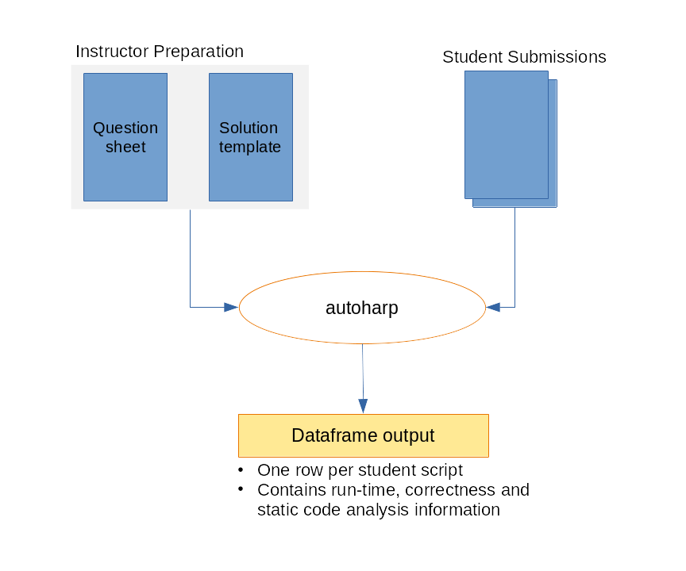
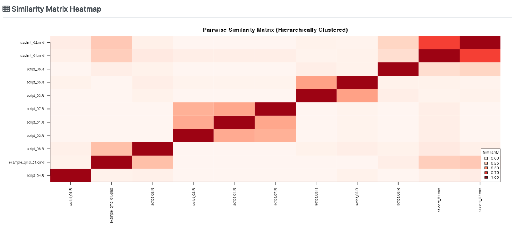

# autoharp 

<!-- badges: start -->
<!--
[](https://github.com/namanlab/test_autoharp_2/actions/workflows/R-CMD-check.yaml)
[](https://namanlab.github.io/test_autoharp_2/)
[](https://opensource.org/licenses/MIT)
-->
<!-- badges: end -->

> **Semi-automatic grading of R and Rmd scripts**: powerful, flexible, and
> designed for real-world teaching at scale.

`autoharp` is an R package that
provides a customisable set of tools for **assessing and grading R or
R Markdown scripts** submitted by students. It goes beyond simple correctness
checking to offer a complete, four-layer grading framework used in production
across undergraduate statistics courses.

---

## Why autoharp?

Grading programming assignments at scale is hard. Students submit diverse
code that may be *correct* but structured differently, or *incorrect* in
subtle ways that output-comparison alone cannot catch. `autoharp` solves
this with four complementary layers:

<div class="feature-grid">

| Feature | What it Does |
|---------|-------------|
| ✅ **Output correctness** | Compare student objects against a reference solution using typed, tolerance-aware checks |
| ⏱️ **Runtime & memory profiling** | Measure how long student code takes and how much memory it uses |
| 🌳 **Static code analysis (AST)** | Inspect Abstract Syntax Trees to check *how* students solved a problem: e.g., "did they use `apply` instead of a `for` loop?" |
| 🔍 **Similarity detection** | Identify suspiciously similar submissions using cosine, Jaccard, or edit-distance metrics |

</div>

---

## The autoharp Workflow

<p align="center">
  
</p>

The workflow has **four phases**:

1. 📝 **Prepare**: Write a question sheet and a *solution template* (an Rmd
   with special `autoharp.objs` / `autoharp.scalars` chunk options)
2. 📤 **Distribute**: Share the question sheet and a blank student template
3. ⚙️ **Grade**: Run `populate_soln_env()` then `render_one()` per student;
   each submission runs in a sandboxed R process
4. 📊 **Review**: Inspect results via logs, thumbnail galleries, and the
   interactive Grading App

---

## Installation


You can install **autoharp** from CRAN with:

```r
install.packages("autoharp")
```

You can also install the development version of autoharp from
[GitHub](https://github.com/namanlab/autoharp) with:

```r
# install.packages("devtools")
devtools::install_github("namanlab/autoharp")
```

---

## Quick Start

```r
library(autoharp)

# 1. Render the solution template to build a reference environment
soln <- populate_soln_env("solution_template.Rmd")

# 2. Grade a student submission (runs in a sandboxed process)
result <- render_one(
  rmd_name  = "student_submission.Rmd",
  soln_env  = soln$soln_env,
  test_file = soln$test_file,
  out_dir   = "grading_output/"
)

# 3. Inspect the grading result
print(result)
```

---

## The Three Pillars of autoharp

### 1. 📄 Complete Documents, Not Snippets

`autoharp` grades **complete, reproducible documents**: entire R scripts or
R Markdown files, rather than isolated code snippets. This encourages good
scientific computing practices and tests the full submission pipeline.

### 2. 🌳 Static Analysis via AST Trees

The `TreeHarp` S4 class represents any R expression as a **rooted tree**,
enabling structural code checks that go beyond output comparison:

```r
# Convert an expression to a tree
tree <- lang_2_tree(quote(mean(x + rnorm(10))))
plot(tree)

# Check for absence of for-loops across an entire student script
forest <- rmd_to_forestharp("student_script.Rmd")
has_for_loop <- any(sapply(forest, function(t) {
  any(t@nodeTypes$name == "for")
}))
```

### 3. 🖥️ Integrated Shiny Applications

`autoharp` ships with **three ready-to-use Shiny applications**:

| App | Audience | Purpose |
|-----|----------|---------|
| **Grading App** | Instructor | Multi-tab GUI for batch grading, session management, and manual plot review |
| **Similarity App** | Instructor | Detect code similarities using cosine, Jaccard, or edit-distance metrics |
| **Solution Checker** | Student | Self-service portal to check submissions before the deadline |

---

## The Grading App

The Grading App provides a complete browser-based interface for the grading
workflow - no command-line required. It features session management,
auto-generated object tests, plot comparison, and batch grading with a live
progress bar.

<p align="center">
  
  <br><em>Batch grading: run render_one() for all student submissions with live progress tracking</em>
</p>

---

## Similarity Detection

The Similarity App helps identify suspiciously similar submissions using
three metrics: cosine similarity, Jaccard index, and edit distance.

<p align="center">
  
  <br><em>Pairwise similarity heatmap: darker cells indicate higher similarity between submissions</em>
</p>

---

## The Solution Checker (Student Portal)

The Solution Checker is a **student-facing portal** where students can
self-check their submission before the deadline.

<p align="center">
  
  <br><em>Students upload their script and instantly see correctness results, lint feedback, and runtime stats</em>
</p>

In a NUS course with **122 students** across two assignments, the Solution
Checker saw peak usage of **19 logins/day** in the final 3 days before
submission, evidence that students actively use it to iterate on their work.

---

## Real-World Validation

`autoharp` was developed and validated at the **National University of
Singapore** across multiple cohorts. Key highlights from production use:

- ✅ Graded hundreds of R/Rmd submissions across statistics courses
- ⏱️ Each submission grades in under 2 minutes in a sandboxed process
- 🔍 Identified multiple cases of academic dishonesty via the Similarity App
- 📝 Students using the Solution Checker showed higher submission quality

---

## Learning More

- 📖 [Get Started](https://namanlab.github.io/autoharp/articles/getting-started.html): step-by-step introduction
- 🌳 [TreeHarp Tutorial](https://namanlab.github.io/autoharp/articles/treeharp-tutorial.html): deep dive into AST-based analysis
- 🔄 [Grading Workflow](https://namanlab.github.io/autoharp/articles/workflow.html): complete end-to-end example
- 🖥️ [Shiny Apps](https://namanlab.github.io/autoharp/articles/shiny-apps.html): interactive tools guide
- 📚 [Function Reference](https://namanlab.github.io/autoharp/reference/index.html): full API documentation

---

## Citation

If you use `autoharp` in your teaching or research, please cite:

```bibtex
@article{gopal2022autoharp,
  title   = {autoharp: An R Package for Autograding R/Rmd/qmd Scripts},
  author  = {Gopal, Vikneswaran and Naman, Agrawal and Huang, Yuting},
  year    = {2026}
}
```

---

## License

MIT © [National University of Singapore](https://www.nus.edu.sg/)
