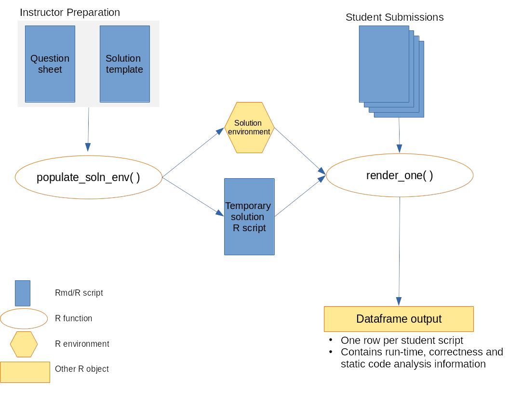

```{r, include = FALSE}
knitr::opts_chunk$set(
  collapse = TRUE,
  comment = "#>"
)
```

```{r setup}
library(autoharp)
```

# Introduction

The purpose of this package is to assist an instructor in grading R codes.  The
following diagram presents an overview of how the autoharp works:

<div align="center">
  
</div>

To use the autoharp for grading, the instructor needs to prepare a solution
template. The autoharp will help to execute the code in each student script,
test the objects in them, and return a convenient dataframe, with one row per
student script.

## Description of Files

Thus, we begin with a simple example. We describe the assignment, solution file,
and two student scripts in the subsequent sections. Following this, we
demonstrate how the package can help.

The files needed to run this example can be found in the `examples` directory
of the `autoharp` package.

```{r ex01_files, echo=TRUE}
list.files(system.file("examples", "example-01", package="autoharp"))
```

This folder contains: 

* 1 x question paper (`sample_questions_01.Rmd`), 
* 1 x solution template (`soln_template_01.Rmd`), and 
* 2 x sample student scripts (`qn01_scr_01.R`, `qn01_scr_02.R`), which are in the 
folder `student_scripts`.

Imagine that `sample_questions_01.Rmd` is a worksheet that you assign to your
students. The question contains the following stem:

---

Consider the following probability density function (pdf) over the support 
$(0,1)$:

\begin{equation*}
f(x) = 
\begin{cases}
4x^3 & \text{if } 0 < x < 1 \\
0 & \text{otherwise}
\end{cases}
\end{equation*}

```{r ex_fn, echo=FALSE}
rf <- function(n) {
  U <- runif(n)
  X <- U^(1/4)
  X
}
```

Write a function called `rf`, that generates i.i.d observations from this pdf.
It should take in exactly one argument, $n$, that determines how many random
variates to return. For instance:

```{r run_fn}
set.seed(33)
rf(n = 5)
```

Now generate 10,000 random variates from this pdf and store them in a vector
named `X`. Your script *must* generate a function named `rf` and a vector named
`X`.

---

## Student Scripts

Consider the two student submissions, that are included with the package.
Student 1 (`qn01_scr_01.R`) has a model solution. However student 2
(`qn01_scr_02.R`) has made a few mistakes: 

  * A `for` loop has been used within the function, 
  * The algorithm itself is wrong, and 
  * The length of the `X` vector is wrong.

# Elements of the Framework

## The Question Paper

The question paper details what the students need to create within their
submission, which could be a plain R script, or an Rmd file. The required
objects could be any R object, such as a data frame, a vector, a list, or a
function. The question paper should clearly state the name of the object(s) and
their key attributes.

For instance, if a function is to be created, the question paper should specify
it's name, number of arguments, names of formal arguments and the return value.

## The Solution Key or Template

The solution template can be an Rmd or a quarto file. It is where you specify
the things that should be checked about the student script. First of all, it
should generate the correct versions of the objects. These "model" objects can
then be used to check against student-created objects.

The autoharp package defines two knitr hooks, for use within the solution
template:

* `autoharp.objs`: This is a character vector of names of objects that are going 
  to be used as the "model" solution. They could be correct values of something 
  the students were asked to evaluate from their data, or a dataset, or a function.
* `autoharp.scalars`: These are character vectors of objects that will be generated
  within the chunk. These are objects that will possibly be generated using 
  student-created objects. For example, it could be the output from running a 
  student-written function.

To make things concrete, let's take a look at the lines 19 to 22 from the 
`soln_template_01.Rmd`:

````markdown
`r ''````{r test01, autoharp.objs=c("rf", "X"), autoharp.scalars=c("lenX", "lenfn")}
lenX <- (length(X) == length(.X))
lenfn <- (length(fn_fmls(rf)) == length(fn_fmls(.rf)))
```
````

The first hook communicates to the autoharp that the objects `rf` and `X`
(created in the previous chunk) are to be used as reference objects - we may wish
to compare the student versions with these later on. In preparation, the
autoharp duplicates them as `.rf` and `.X`.

The second one informs the autoharp that the subsequent code, when run on 
student-created `X` and `rf`, should yield two values: `lenX` and `lenfn`. These
should be returned as part of the "correctness checks" for each student.

Here is another example of a chunk that will return autoharp scalars:

````markdown
`r ''````{r testxx, autoharp.scalars=c("max_X", "min_X")}
max_X <- max(X)
min_X <- min(X)
```
````

In short, these chunks contain normal R code that utilise the objects created by
students. However, they could also contain autoharp code that analyses the
structure of student R code. For instance, the following `autoharp`-specific
code would extract the number of calls made to `mutate` in the student script:

````markdown
`r ''````{r testxxx, autoharp.scalars=c("f1", "mutate_count")}
f1 <- rmd_to_forestharp(.myfilename)
mutate_count <- fapply(f1, count_fn_call, combine = TRUE, pattern="mutate")
```
````

`rmd_to_forestharp`, `count_fn_call` and `fapply` are `autoharp` functions. The
variable `.myfilename` is hard-coded to contain the path to the current student
script. It allows the autoharp to access the student file from within the
solution script.

# How the Elements Work Together

Here is a visual depiction of how the elements work together, alongside autoharp
functions.

<div align="center">
  
</div>

1. First, the solution environment has to be populated. This is where the
   `populate_soln_env` from autoharp comes into play. The inputs to this function
   are 

   * the solution script, 
   * a pattern that identifies which chunks are test chunks, and  
   * the directory to knit the solution script in. 

   The return object from this function is a list of length 2,
   containing the solution environment, and a path to the solution script. 
    
2. The next step is to render the student script or Rmd into a html file. This is
   done within the `render_one` function of autoharp. Once the student file has been
   successfully rendered, the objects it generates are stored in the **student_environment**. 

   Rendering of student files is carried out in a separate R process, so that paths 
   are reset for each student. At this point, run-time statistics would already 
   have been generated. 
    
3. The next step is to run the correctness check. The "model" objects from the 
   **solution  environment** are then copied into the student environment. Remember,
   these should not conflict with what is in the student environment, because they 
   would have a period in their prefix. For instance, the student environment 
   will now contain `.X` (from solution template) and `X` (from student).

4. Correctness is assessed by running the temporary solution script (from step 1) within
   the student environment. The `autoharp.scalars` are then appended to the runtime 
   statistics to generate a data frame with one row for each student script.

# Package Output 

Here is how the autoharp package can be used to assess the scripts.

```{r motivating_example, eval=FALSE, echo=TRUE}
soln_fname <- system.file("examples", "example-01", "soln_template_01.Rmd", 
			                    package="autoharp")
temp_dir <- tempdir()
s_env <- populate_soln_env(soln_fname, pattern = "test", knit_root_dir = temp_dir)
stud_script_names <- list.files(system.file("examples", "example-01", 
					                                  "student_scripts", package="autoharp"), 
                                full.names = TRUE) 

corr_out <- lapply(stud_script_names, render_one, out_dir = temp_dir, 
                   knit_root_dir = temp_dir, soln_stuff = s_env)

do.call("rbind", corr_out)
```
