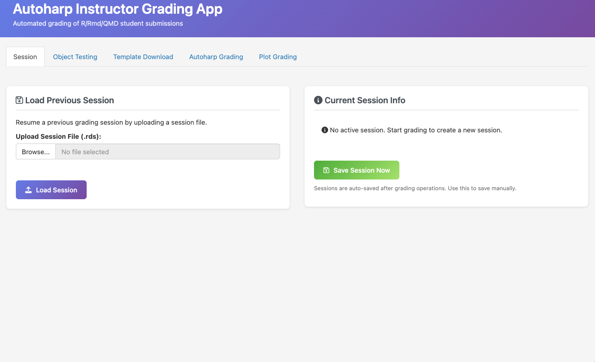
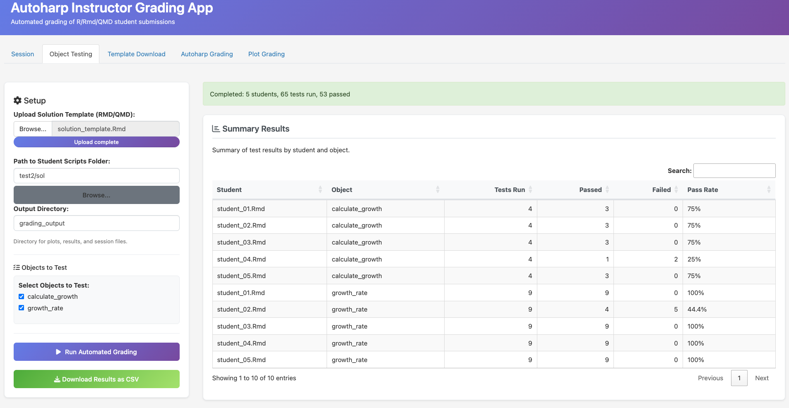
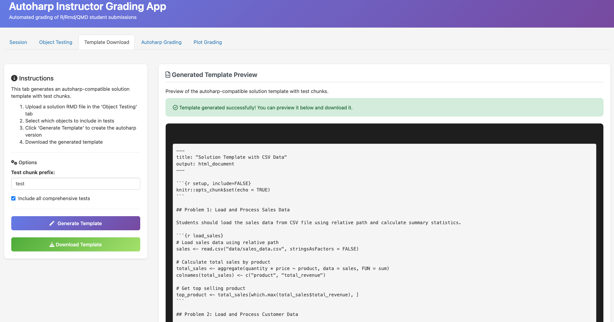
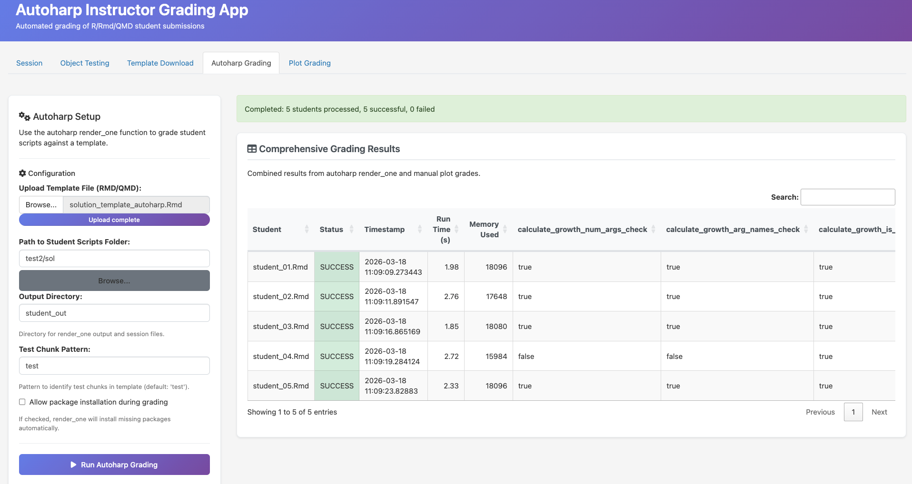
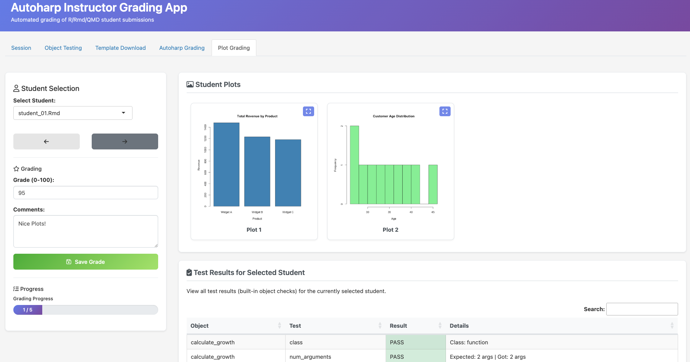

```{r, include = FALSE}
knitr::opts_chunk$set(
  collapse = TRUE,
  comment = "#>"
)
```

# Introduction

The grading app is an instructor-facing [shiny](https://shiny.posit.co/) web
application that provides a comprehensive environment for evaluating student
submissions. Unlike the similarity app, which focuses on comparing submissions
to each other, the grading app centers on assessing correctness against a
solution template. It combines automated object-level testing with manual plot
grading, session persistence for interrupted workflows, and template generation
for use with autoharp's `render_one()` function. To run the grading app locally:

```{r grading-app-run, eval=FALSE, echo=TRUE}
library(shiny)
runApp(system.file(file.path('shiny', 'grading_app', 'app.R'),
                   package = 'autoharp'))
```

The application organizes its functionality across five tabs: Session
management for saving and resuming work, Object Testing for automated
correctness checks, Template Download for generating autoharp-compatible
templates, Autoharp Grading for running `render_one` workflows, and Plot
Grading for manual assessment of visualizations.

## Session Management

A key design principle of the grading app is workflow persistence. Grading
large classes often spans multiple sessions, and losing progress due to
application restarts or system interruptions can be frustrating. The Session
tab addresses this by providing save and resume functionality.
Sessions are stored as RDS files containing the complete application state:
solution objects, student file lists, grading results, plot grades with
comments, and the current position in the grading workflow. The application
auto-saves after significant operations (completing automated grading, saving
plot grades, finishing autoharp grading), and instructors can trigger manual
saves at any time.

<div align="center">
  
</div>

To resume a previous session, the instructor uploads the saved RDS file and
clicks "Load Session." The application restores all state, including input
field values and the current student being graded, allowing work to continue
exactly where it left off.

## Automated Object Testing

The Object Testing tab implements type-aware correctness checking without
requiring instructors to write test code. The instructor uploads a solution
template (an R Markdown or Quarto file containing correct implementations) and
specifies the folder containing student submissions. The application then
executes both the solution and each student script in isolated environments,
comparing the objects they produce.

<div align="center">
  
</div>

The key innovation in this tab is the type-based test generation. When the
solution template is executed, the application inspects each created object and
determines its type. Based on this type information, it generates appropriate
tests automatically.


## Template Generation

While the Object Testing tab provides immediate feedback, instructors may want
to use autoharp's full `render_one()` workflow for more detailed grading.
The Template Download tab bridges these approaches by generating
autoharp-compatible solution templates with properly formatted test chunks.

<div align="center">
  
</div>

The template generator works by analyzing the solution environment and creating
test chunks that mirror the automated tests from the Object Testing tab. Each
chunk includes the `autoharp.objs` option (specifying which objects to extract
from student code) and the `autoharp.scalars` option (specifying which test
results to record). The generated code follows \pkg{autoharp}'s conventions,
using dot-prefixed names for solution objects (e.g., `.X` for the solution's
`X` object). Instructors can preview the generated template before downloading, allowing
them to verify the test structure and make any necessary adjustments. The
downloaded template can then be used directly with `populate_soln_env()` and
`render_one()`.

## Autoharp Grading Integration

The Autoharp Grading tab provides a graphical interface for running
autoharp's core grading workflow. Instead of writing R scripts to call
`populate_soln_env()` and `render_one()`, instructors upload a template file
and specify the student scripts folder through the interface.

<div align="center">
  
</div>

The tab offers several configuration options:

*   *Test chunk pattern.* The pattern used to identify test chunks in the
    template (defaulting to "test"). This corresponds to the `pattern` argument
    of `populate_soln_env()`.
*   *Permission to install packages.* Whether `render_one()` should
    automatically install packages that student scripts require but are not
    present on the grading machine.
*   *Output directory.* Where rendered HTML files, logs, and session files are
    stored.

After grading completes, results appear in a comprehensive table showing run
status (SUCCESS or FAIL), execution time, memory usage, and all correctness
check scalars defined in the template. If plot grades have been assigned in the
Plot Grading tab, they appear alongside the automated results. 
The tab includes an Excel export feature that creates a workbook with two
sheets: one containing all `render_one()` results and another containing plot
grades and comments. This format facilitates integration with course management
systems and grade books.

## Manual Plot Grading

The Plot Grading tab addresses a challenge that automated systems cannot fully
solve: evaluating the quality of data visualizations. While code correctness
can be verified programmatically, assessing whether a plot effectively
communicates its message requires human judgment.

<div align="center">
  
</div>

When automated grading runs (either through the Object Testing tab or the
Autoharp Grading tab), the application collects all plots generated by each
student script. These plots are stored in a structured directory hierarchy
within the output folder.

The Plot Grading interface allows instructors to navigate through students
sequentially (using Previous/Next buttons or a dropdown selector), view all
plots for the current student, and assign numeric grades with optional
comments. Clicking a plot thumbnail opens an expanded view in a modal dialog,
making it easier to examine details. The tab also displays a summary of
automated test results for the current student, providing context when
assessing plots. For example, if a student's data processing produced incorrect
values, this context helps explain why their visualization may look different
from expectations.  A progress bar tracks grading completion, and all grades
are auto-saved to the session file after each entry. This combination of
automated collection, easy navigation, and persistent storage streamlines what
would otherwise be a tedious manual process.
