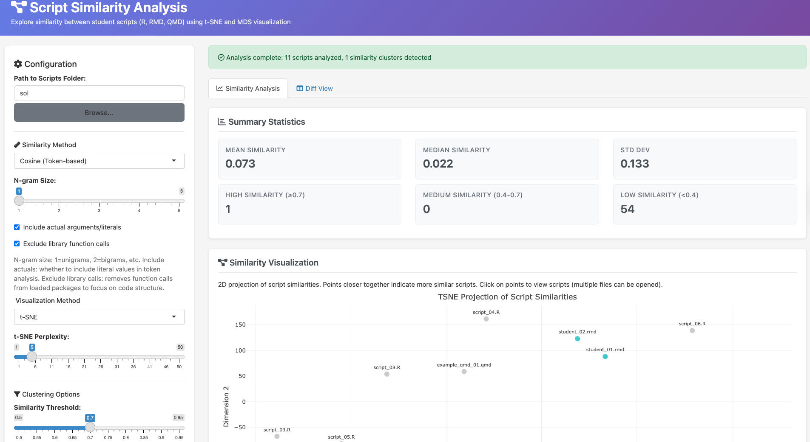
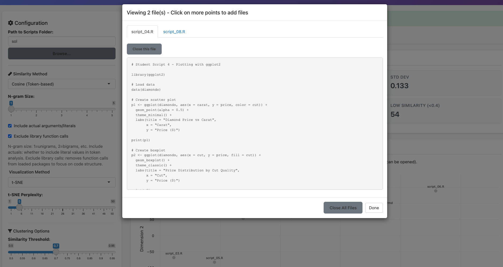

```{r, include = FALSE}
knitr::opts_chunk$set(
  collapse = TRUE,
  comment = "#>"
)
```

# Introduction

The similarity app is an instructor-facing [shiny](https://shiny.posit.co/) web
application for analyzing code similarity across a batch of student
submissions. While the solution checker helps individual students validate
their work before submission, the similarity app helps instructors review an
entire class at once. It can identify clusters of suspiciously similar scripts,
visualize how different students approached the same problem, and provide a
side-by-side comparison of any two submissions. This makes the application
useful both for detecting potential plagiarism and for understanding the range
of solutions students produce.

To run the similarity app locally:

```{r similarity-app-run, eval=FALSE, echo=TRUE}
library(shiny)
runApp(system.file(file.path('shiny', 'similarity_app', 'app.R'),
                   package = 'autoharp'))
```

When the application launches, the instructor is presented with a configuration
panel on the left and a results area on the right. The configuration panel
allows the instructor to specify the folder containing student scripts, choose
a similarity method and visualization technique, and set a threshold for
cluster detection.

<div align="center">
  
</div>

The application supports three methods for computing pairwise similarity:

1.  *Cosine similarity (token-based).* This is the default and recommended
    method for most use cases. It parses each script into tokens using
    \pkg{autoharp}'s `rmd_to_token_count()` function, constructs TF-IDF
    weighted frequency vectors, and computes cosine similarity between them.
    The method is fast and robust to formatting differences. Instructors can
    configure n-gram size (from unigrams to 5-grams), choose whether to include
    literal values in the token set, and optionally exclude function calls from
    loaded packages to focus on the structure of student-written code.

2.  *Jaccard similarity (set-based).* This method compares the unique tokens
    present in each script using the Jaccard index (intersection over union).
    Unlike cosine similarity, it ignores how often tokens appear and focuses
    only on whether they appear at all. This can be useful when detecting
    shared vocabulary matters more than shared patterns of use.

3.  *Edit distance.* This method computes the Levenshtein edit distance between
    the raw code strings, normalized by the length of the longer script. It is
    the strictest method, sensitive to whitespace, variable names, and
    formatting. It works best for detecting near-verbatim copies.

After selecting a similarity method, the instructor chooses a visualization
technique. The application offers t-SNE (t-Distributed Stochastic Neighbor
Embedding) via [Rtsne](https://cran.r-project.org/package=Rtsne), which excels at revealing local
clusters, and MDS (Multi-Dimensional Scaling), which provides a more stable,
deterministic projection that preserves global distances. The resulting 2D
scatter plot is rendered using
[plotly](https://cran.r-project.org/package=plotly), making it
interactive: instructors can hover over points to see script names and click to
view the full script content.

<div align="center">
  
</div>

The application also generates a hierarchically clustered heatmap showing all
pairwise similarity scores. This visualization makes it easy to spot blocks of
high similarity and understand the overall distribution of scores across the
class.

<div align="center">
  
</div>

Below the visualizations, the application presents several summary panels:

*   *Summary statistics.* Mean, median, and standard deviation of pairwise
    similarities, along with counts of high-similarity (0.7 and above),
    medium-similarity (0.4 to 0.7), and low-similarity (below 0.4) pairs.
*   *Top similar pairs.* A sortable \CRANpkg{DT} [@DT] table listing the script
    pairs with highest similarity scores, allowing instructors to quickly
    identify submissions that warrant closer review.
*   *Detected clusters.* Groups of scripts whose pairwise similarities all
    exceed the configured threshold. Each cluster is listed with its member
    scripts, making it easy to identify groups that may have collaborated or
    copied.
*   *Full similarity matrix.* A searchable table containing all pairwise
    similarity scores, which can be downloaded as a CSV file for record-keeping
    or further analysis.

The application also includes a dedicated Diff View tab for detailed comparison
of any two scripts. Instructors select two files from dropdown menus and click
"Compare Scripts" to see a side-by-side view with synchronized scrolling. Lines
are color-coded to highlight differences: yellow for modified lines, green for
additions, and red for deletions.

Here is an outline of the files in the similarity app directory:

```{r similarity-app-files, echo=TRUE}
list.files(system.file("shiny", "similarity_app", package = "autoharp"))
```

*   `app.R`: Contains the UI and server logic for the application.
*   `R/helpers.R`: Helper functions for token parsing, similarity computation,
    dimensionality reduction, and cluster detection.
*   `www/styles.css`: Custom CSS for styling the application interface.
*   `README.md`: Documentation with usage instructions and guidance on choosing
    between similarity methods.
*   `sol/`: A folder containing example scripts for demonstration purposes.

The `R/helpers.R` file implements the core computational functions. For cosine
similarity, it uses a vectorized approach that constructs a document-term
matrix and computes all pairwise similarities in a single matrix operation,
making it efficient even for large classes. For Jaccard and edit distance,
which require pairwise computation, the app supports parallel processing on
Linux and macOS through the `n_cores` parameter, using `parallel::mcmapply()`
to distribute the workload across multiple CPU cores.

Interpreting similarity scores requires context. A score of 1.0 indicates
identical scripts. Scores between 0.7 and 0.99 suggest high similarity that may
warrant investigation. Scores between 0.4 and 0.69 typically indicate similar
approaches or shared patterns, which may be expected when students solve the
same problem. Scores below 0.4 generally indicate distinct implementations. The
similarity threshold slider (defaulting to 0.7) controls how aggressively the
app groups scripts into clusters; a higher threshold produces fewer, tighter
clusters.

