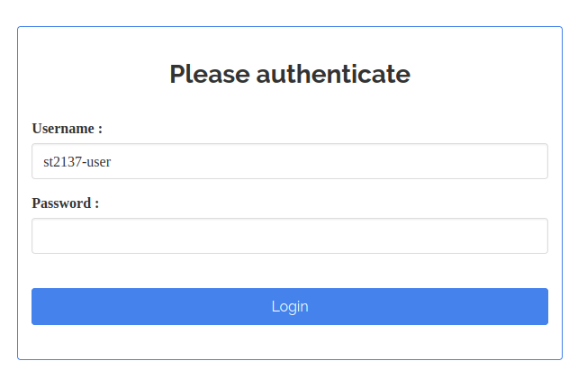
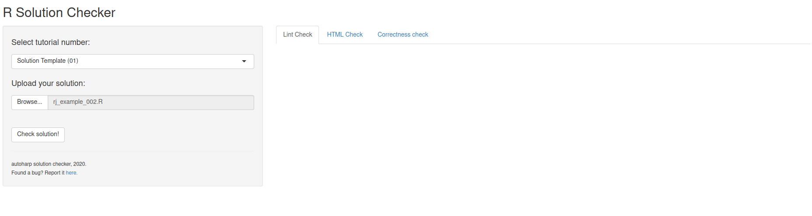
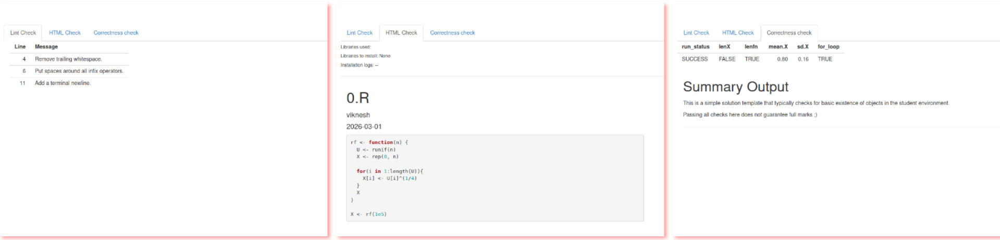

```{r, include = FALSE}
knitr::opts_chunk$set(
  collapse = TRUE,
  comment = "#>"
)
```

The solution checker [shiny](https://shiny.posit.co/) web application is a
student-facing application. It is meant to be deployed on a server that is
accessible to students, prior to the actual submission of their solution.
Students can use it to ensure that the instructor will be able to run their
code smoothly upen actual submission. In the workflow of \pkg{autoharp}, the
deployment of the solution checker is optional. However, the use of the
application greatly assists in weeding out common errors that prevent the
instructor from being able to run the student's code. These include:

1.  Incorrect path settings. Especially in the initial weeks of a course, it is 
    common for students to use absolute path settings instead of a relative
    path, that mirrors the instructor's set-up. While there are packages that 
    attempt to identify and correct the path setting, this goes against the
    principle of the course - to get students to accommodate the coding
    conventions of a team.
2.  Case mismatch between student-generated R objects, and the objects required
    by the solution template. 
3.  Objects missing from the student environment.

To deploy the solution checker, the instructor should have access to a shiny
server. Since students will be submitting code that will be *executed* on the
server, the instructor needs to take precautions. The first is to ensure that
the shiny applications are not run as the privileged user. The second is to
ensure that only students from the course have access to the application.  This
feature is already built into the application, since it requires a database of
users who will be authenticated before they can access the application. This
authentication is carried out using
[shinymanager](https://cran.r-project.org/package=shinymanager).
Finally, if possible, the instructor could situate the server behind a VPN,
thus preventing complete and unfettered public access to the server.

The solution checker relies on functions within the \pkg{autoharp} itself. To
use it, a student selects the appropriate solution template, uploads their
script, and finally hits Submit. The application will then render the script to
html format, using `render_one`. The rendered html file is presented in the
first tab, while a set of correctness checks are presented in the second tab.

It should follow from the above outline, that the solution checker can be used
for multiple assignments; the instructor can prepare a minimal solution
template for each of these, and store them on the server. When the server
initially begins, a separate solution environment will be generated for each of
the solution templates. This avoids having to re-generate solution environments
every time a new user establishes a connection and submits a script.

Here is an outline of the files in the shiny application directory:

```{r solution-checker-files, echo=TRUE}
list.files(system.file("shiny", "solution_checker", package="autoharp"))
```

* `app.R`: Contains the UI (User Interface) and server logic for the
  application.
* `db_creation.R`: A helper script to create an SQLite database containing
  usernames, passwords and roles.
* `R/`: A folder containing a single file `globals.R`. This contains
  deployment-specific information, such as paths to datasets, working
  directories, and so on.
* `README.md`: A quick guide to get started with using the solution checker.
* `soln_templates/`: A folder containing all the solution templates that will
  be available for students to use, when the server is deployed.

Within `db_creation.R`, the function call to `shinymanager::create_db` creates
an encrypted database. Encryption is carried out using the passphrase stored in
the environment variable `AUTOHARP_TUNER_DB_KEY`. 

```{r solution-checker-db-creation, eval=FALSE}
create_db(credentials_data = credentials,
          sqlite_path = "st2137.sqlite",
          passphrase = Sys.getenv("AUTOHARP_TUNER_DB_KEY") 
          )
```

This same environment variable must also be present on the deployment server.
The simplest way to set the environment variable is to include it in a file
named `.Renviron` within the shiny application folder. The script
`db_creation.R` does not need to be kept on the server; only the database, which
is currently named `st2137.sqlite`, needs to be on the server.

The user interface (UI) of the server is defined in `app.R`. When a student
navigates to the page, they will first encounter the password input dialog box.

<div align="center">
  
</div>

The main UI consists of a sidebar on the left, where the student selects the 
appropriate template for their script, uploads their own script, and clicks 
"Check solution!".

<div align="center">
  
</div>

After the application has processed the student script, the output will be shown 
in three tabs. The leftmost tab lists lints. These are style checks, that will 
help to enforce good coding habits in students. The second tab displays the rendered
HTML version of the script. If this appears without errors, then the student 
can be confident that the instructor will be able to run the script. Finally,
the rightmost tab displays basic correctness checks. If one of these fail, the 
student would be encouraged to check their code to fix the problem before 
submitting their script.

<div align="center">
  
</div>

Apart from the database creation, all server configuration is managed through the 
file `globals.R` that is situated within the `R/` folder of the application. These 
are the most important settings to take note of:

```{r eval=FALSE}
soln_templates_dir <- "/home/viknesh/NUS/coursesTaught/autoharp/mytesting/secure_tuner/soln_templates"
knit_wd <- "/home/viknesh/NUS/coursesTaught/autoharp/mytesting/secure_tuner/"
permission_to_install <- FALSE
max_time <- 120

summary_header <- "# Summary Output"
tabs <- c("lint", "html", "correctness")
app_title <- "R Solution Checker"
corr_cols_to_drop = c(1,2,4,5)
db_key <- Sys.getenv("AUTOHARP_TUNER_DB_KEY")
```

The first set of 4 lines above configure how `render_one` will be executed by
the solution checker application. 

The next set of 5 lines  pertain directly to the application. 

The `summary_header` is used to indicate which portion of the solution template
file should be extracted and displayed to the student under the "Correctness
check" tab. This can be used by the instructor to convey information to the
student about the purpose of the server. 

The `tabs` variable indicates which of the three output tabs should be
generated; the instructor may not want to show lints, for instance. 

The `corr_cols_to_drop` specifies that certain columns from the raw correctness
check output can be dropped before displaying. In the above output, the columns
`fname`, `time_stamp`, `run_time` and `run_mem` are dropped, since they are
more useful to the instructor rather than the individual student.
